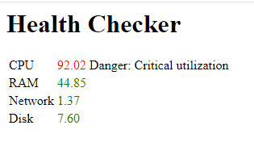

## Описание
health-checker это сервис, который проверяет загруженность систем и возвращает 503 ошибку, если загруженность превышает границу превышения.
Он также предоставляет эндпоинт для проверки своего состояния (`address/check`). В случае если загруженность какой-то системы входит в зону значительного превышения порога, то через 10 интервалов, 
заданных пользователем, эндпоинт начнет сообщать об этом. Отслеживаются утилизации CPU, RAM, сети (только физического адаптера) и дискового I/O.

## Доступность
Приложение доступно только для Windows 10+ из-за использования WMI и специфических классов для получения информации о системе.

## Флаги/Переменные окружения
| Флаги/Переменные окружения | Описание                                                                                                                | Стандартное значение | 
|----------------------------|-------------------------------------------------------------------------------------------------------------------------|----------------------|
| -i / CHECK_INTERVAL        | Интервал в секундах, по тику которого будет проводиться опрос систем.                                                   | 60 секунд            |
| -p / PORT                  | Порт, по которому будет доступно приложение                                                                             | 8080                 |
| -a / ADDRESS               | Адрес, по которому будет доступно приложение                                                                            | localhost            |
| -d / DEBUG                 | Если установлен, то в консоль будут выводиться сообщения отладки _(Не указывайте, если вам не нужны сообщения отладки)_ | false                |

_Заметьте, что если указаны и флаги и переменные окружения, то переменные окружения имеют больший приоритет_

## Стандартные границы превышения значений
| Система | Граница превышения | Желтая зона * |
|---------|--------------------|---------------|
| CPU     | 90%                | 75%           |
| RAM     | 90%                | 75%           |
| Сеть ** | 90%                | 80%           |
| Диск    | 90%                | 80%           |

_* Желтая зона -- зона, при нахождении в которой в течении 10 интервалов начнет показываться уведомление при обращению к чекпоинту_
_** Обратите внимание, что получение утилизации сети идёт только для физического адаптера_
## Использование
Скомпилируйте придожение с помощью команды `go build` или загрузите его из релизов на Гитхабе и запустите. Укажите флаги если необходимо.

## Прослушивание эндпоинта
Приложение будет ожидать GET-запросы на `address:port/check` эндпоинте.

## Пример работы
Запустите приложение командой `health-checker.exe -i 10s -p 8080 -a localhost -d` или `CHECK_INTERVAL=10s PORT=8080 ADDRESS=localhost DEBUG=true health-checker.exe`

## Используемые библиотеки
- [env](https://github.com/caarlos0/env) для парсинга переменных окружения
- [testify](https://github.com/stretchr/testify) для тестирования
- [wmi](https://github.com/yusufpapurcu/wmi) для обращения через WMI к системе
